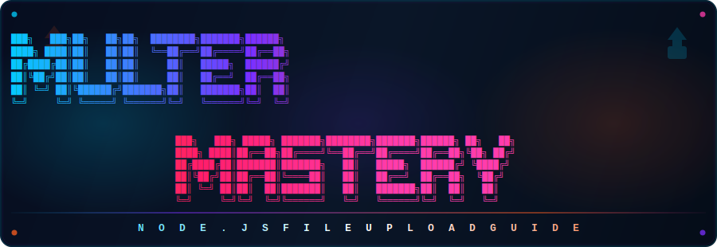

<div align="center">

<!-- BANNER -->


# 🚀 Multer Mastery — Complete Learning Repository

### *From Zero to Production — Node.js File Upload Ka Sampoorna Guide*

---

[](https://github.com)
[](LICENSE)
[](CONTRIBUTING.md)
[](https://nodejs.org)
[](https://expressjs.com)
[](https://github.com/expressjs/multer)
[](https://github.com)
[](README.md)

---

> 📖 **"Ek Comprehensive Guide Jo YouTube Videos Aur Docs Ki Zaroorat Khatam Kar De"**
> 
> *This repository is designed so that a complete beginner can master Multer from scratch to production level.*

---

</div>

## 🎯 Is Repository Ke Baare Mein (About This Repository)

**Multer** ek Node.js middleware hai jo **multipart/form-data** ko handle karta hai — yaani **file uploads** manage karta hai. Jab bhi aapne kisi website pe apni photo upload ki, ya koi PDF bheja, toh backend mein ek aisa middleware kaam kar raha tha. Yahi Multer karta hai.

Yeh repository **completely free** hai aur isme:

| Feature | Status |
|---------|--------|
| ✅ Beginner to Advanced Coverage | Complete |
| ✅ 20+ Code Examples | With Line-by-Line Explanation |
| ✅ 4 Real-World Projects | Beginner → Production Level |
| ✅ 300+ Interview Questions | With Detailed Answers |
| ✅ Visual Diagrams & Flowcharts | Mermaid + ASCII Art |
| ✅ Cheat Sheets | One-page Reference |
| ✅ Hindi + English Mixed | Easy to Understand |
| ✅ Practice Exercises | With Solutions |

---

## 🗺️ Learning Roadmap (Sikhne Ka Rasta)

```
WEEK 1: FOUNDATIONS
━━━━━━━━━━━━━━━━━━━━━━━━━━━━━━━━━━━━━━━━━━━━━━━━━━━━━━━━━━━
📌 Chapter 01 — Introduction to File Uploads & Multer
📌 Chapter 02 — Setting Up Multer (Installation & Config)
📌 Chapter 03 — diskStorage vs memoryStorage
📌 Chapter 04 — Single File Upload

WEEK 2: CORE FEATURES
━━━━━━━━━━━━━━━━━━━━━━━━━━━━━━━━━━━━━━━━━━━━━━━━━━━━━━━━━━━
📌 Chapter 05 — Multiple File Upload
📌 Chapter 06 — File Filtering & Validation
📌 Chapter 07 — File Size Limits & Error Handling
📌 Chapter 08 — Custom File Naming & Destination

WEEK 3: ADVANCED FEATURES
━━━━━━━━━━━━━━━━━━━━━━━━━━━━━━━━━━━━━━━━━━━━━━━━━━━━━━━━━━━
📌 Chapter 09 — Cloud Storage (Cloudinary + AWS S3)
📌 Chapter 10 — Image Processing with Sharp
📌 Chapter 11 — Security Best Practices
📌 Chapter 12 — Performance Optimization

WEEK 4: REAL-WORLD PROJECTS
━━━━━━━━━━━━━━━━━━━━━━━━━━━━━━━━━━━━━━━━━━━━━━━━━━━━━━━━━━━
📌 Project 01 — Profile Picture Upload System
📌 Project 02 — Document Management System
📌 Project 03 — Multi-Media Gallery App
📌 Project 04 — Production-Ready File Server
```

---

## 📁 Folder Structure (Folder Ka Ped)

```
Multer-Mastery/
│
├── 📄 README.md                    ← Yeh file (aap abhi yahi padh rahe ho)
├── 📄 CONTRIBUTING.md              ← Contribute karne ka tarika
├── 📄 CHANGELOG.md                 ← Kya kya badla
├── 📄 LICENSE                      ← MIT License
│
├── 📁 assets/                      ← Visual materials
│   ├── 📁 diagrams/                ← Architecture diagrams
│   ├── 📁 flowcharts/              ← Process flowcharts
│   └── 📁 illustrations/           ← Concept illustrations
│
├── 📁 chapters/                    ← Main learning content
│   ├── 📄 chapter-01-introduction.md
│   ├── 📄 chapter-02-setup.md
│   ├── 📄 chapter-03-storage.md
│   ├── 📄 chapter-04-single-upload.md
│   ├── 📄 chapter-05-multiple-upload.md
│   ├── 📄 chapter-06-file-filtering.md
│   ├── 📄 chapter-07-error-handling.md
│   ├── 📄 chapter-08-custom-naming.md
│   ├── 📄 chapter-09-cloud-storage.md
│   ├── 📄 chapter-10-image-processing.md
│   ├── 📄 chapter-11-security.md
│   └── 📄 chapter-12-performance.md
│
├── 📁 examples/                    ← Working code examples
│   ├── 📁 01-basic-upload/
│   ├── 📁 02-multiple-files/
│   ├── 📁 03-file-validation/
│   ├── 📁 04-cloudinary-upload/
│   ├── 📁 05-aws-s3-upload/
│   └── 📁 06-image-processing/
│
├── 📁 interview/                   ← Interview preparation
│   ├── 📄 beginner-questions.md
│   ├── 📄 intermediate-questions.md
│   ├── 📄 advanced-questions.md
│   ├── 📄 scenario-questions.md
│   └── 📄 company-questions.md
│
├── 📁 exercises/                   ← Practice problems
│   ├── 📄 beginner-exercises.md
│   ├── 📄 intermediate-exercises.md
│   └── 📄 advanced-exercises.md
│
├── 📁 cheatsheets/                 ← Quick reference
│   ├── 📄 multer-cheatsheet.md
│   └── 📄 interview-revision.md
│
└── 📁 projects/                    ← Real-world projects
    ├── 📁 01-profile-picture/
    ├── 📁 02-document-manager/
    ├── 📁 03-media-gallery/
    └── 📁 04-production-file-server/
```

---

## 📖 Chapter Index (Chapters Ki List)

| # | Chapter | Topic | Level | Time |
|---|---------|-------|-------|------|
| 01 | [Introduction](chapters/chapter-01-introduction.md) | File uploads kya hote hain, Multer ka introduction | 🟢 Beginner | 30 min |
| 02 | [Setup & Installation](chapters/chapter-02-setup.md) | NPM install, first config | 🟢 Beginner | 20 min |
| 03 | [Storage Engines](chapters/chapter-03-storage.md) | diskStorage vs memoryStorage | 🟡 Intermediate | 45 min |
| 04 | [Single File Upload](chapters/chapter-04-single-upload.md) | Ek file upload karna | 🟢 Beginner | 30 min |
| 05 | [Multiple File Upload](chapters/chapter-05-multiple-upload.md) | Multiple files handle karna | 🟡 Intermediate | 40 min |
| 06 | [File Filtering](chapters/chapter-06-file-filtering.md) | File type validation | 🟡 Intermediate | 35 min |
| 07 | [Error Handling](chapters/chapter-07-error-handling.md) | Errors ko handle karna | 🟡 Intermediate | 45 min |
| 08 | [Custom Naming](chapters/chapter-08-custom-naming.md) | Files ko custom naam dena | 🟡 Intermediate | 30 min |
| 09 | [Cloud Storage](chapters/chapter-09-cloud-storage.md) | Cloudinary & AWS S3 | 🔴 Advanced | 60 min |
| 10 | [Image Processing](chapters/chapter-10-image-processing.md) | Sharp ke saath resize, compress | 🔴 Advanced | 50 min |
| 11 | [Security](chapters/chapter-11-security.md) | Security best practices | 🔴 Advanced | 45 min |
| 12 | [Performance](chapters/chapter-12-performance.md) | Production optimization | 🔴 Advanced | 40 min |

---

## ⚡ Quick Start (Jaldi Shuroo Karein)

### Prerequisites (Pehle Yeh Zaroori Hai)

```bash
# Check if Node.js is installed
node --version    # Should be 14 or higher

# Check if npm is installed
npm --version     # Should be 6 or higher
```

### Installation (Install Karo)

```bash
# Step 1: Clone the repository
git clone https://github.com/kaif1119/MERN-Stack-Guide.git

# Step 2: Enter the Multer-Mastery directory
cd MERN-Stack-Guide/Multer-Mastery

# Step 3: Go to any example
cd examples/01-basic-upload

# Step 4: Install dependencies
npm install

# Step 5: Run the example
node server.js
```

### Test karo (5 min mein!)

```bash
# Using curl to upload a file
curl -X POST http://localhost:3000/upload \
  -F "file=@/path/to/your/image.jpg"

# Expected Output:
# { "message": "File uploaded successfully!", "filename": "1234567890-image.jpg" }
```

---

## 📚 Prerequisites (Pehle Yeh Seekho)

Multer seekhne se pehle inki basic knowledge honi chahiye:

| Topic | Why Needed | Resource |
|-------|-----------|----------|
| Node.js Basics | Multer Node.js middleware hai | [nodejs.org](https://nodejs.org) |
| Express.js | Multer Express ke saath use hota hai | [expressjs.com](https://expressjs.com) |
| HTTP Methods (POST, GET) | File upload POST method se hota hai | [MDN Docs](https://developer.mozilla.org) |
| HTML Forms | File input field samajhna | [W3Schools](https://w3schools.com) |
| npm Basics | Package install karna | [npmjs.com](https://npmjs.com) |

---

## 🎓 Progress Checklist (Apna Progress Track Karo)

Copy this checklist and track your learning:

```markdown
## My Multer Learning Progress

### Foundations
- [ ] Chapter 01: Introduction to File Uploads & Multer
- [ ] Chapter 02: Setup & Installation
- [ ] Chapter 03: Storage Engines

### Core Features  
- [ ] Chapter 04: Single File Upload
- [ ] Chapter 05: Multiple File Upload
- [ ] Chapter 06: File Filtering & Validation
- [ ] Chapter 07: Error Handling

### Advanced Topics
- [ ] Chapter 08: Custom File Naming
- [ ] Chapter 09: Cloud Storage Integration
- [ ] Chapter 10: Image Processing with Sharp
- [ ] Chapter 11: Security Best Practices
- [ ] Chapter 12: Performance Optimization

### Projects
- [ ] Project 01: Profile Picture Upload
- [ ] Project 02: Document Management System
- [ ] Project 03: Media Gallery App
- [ ] Project 04: Production File Server

### Interview Prep
- [ ] 100 Beginner Questions
- [ ] 100 Intermediate Questions
- [ ] 100 Advanced Questions
- [ ] 50 Scenario Questions
- [ ] 50 Company Questions
```

---

## ❓ FAQ (Aksar Poochhe Jaane Wale Sawaal)

<details>
<summary><b>Q: Multer kya hai aur kyon use karte hain?</b></summary>

**Ans:** Multer ek Node.js middleware hai jo `multipart/form-data` format mein aane wali requests ko parse karta hai. Jab aap koi file upload karte hain, browser is special format mein data bhejta hai. Multer ise handle karta hai.

</details>

<details>
<summary><b>Q: Multer aur Busboy mein kya fark hai?</b></summary>

**Ans:** Busboy ek low-level streaming parser hai. Multer internally Busboy ka use karta hai. Matlab Multer ek wrapper hai jo Busboy ko simple banata hai.

</details>

<details>
<summary><b>Q: Kya Multer TypeScript mein use kar sakte hain?</b></summary>

**Ans:** Haan! `@types/multer` package install karke TypeScript mein fully use kar sakte hain.

```bash
npm install @types/multer --save-dev
```

</details>

<details>
<summary><b>Q: Maximum file size kitni hoti hai by default?</b></summary>

**Ans:** By default Multer ki koi file size limit nahi hoti. Aapko manually `limits` option mein set karni padti hai. Production mein hamesha limit set karo!

</details>

<details>
<summary><b>Q: Multer cloud storage (Cloudinary, S3) ke saath kaam karta hai?</b></summary>

**Ans:** Haan! Multer ka storage engine extensible hai. `multer-storage-cloudinary` aur custom S3 storage ke saath perfectly kaam karta hai.

</details>

---

## 🤝 Contributing (Contribute Karo)

Contributions are welcome! Dekho [CONTRIBUTING.md](CONTRIBUTING.md) for details.

```bash
# Fork → Clone → Branch → Commit → Push → Pull Request
git checkout -b feature/add-new-chapter
git commit -m "feat: add chapter on Multer streams"
git push origin feature/add-new-chapter
```

---

## 📄 License

[MIT License](LICENSE) — Free hai, use karo, share karo, seekho!

---

## 👨‍💻 Author

**Created with ❤️ for the developer community**

> *"Jo seekh ke aage badhe, woh kabhi nahi roke"*

---

<div align="center">

**⭐ Agar yeh helpful laga toh Star dena mat bhoolo! ⭐**

*Made for Beginners, Polished for Professionals*

</div>
