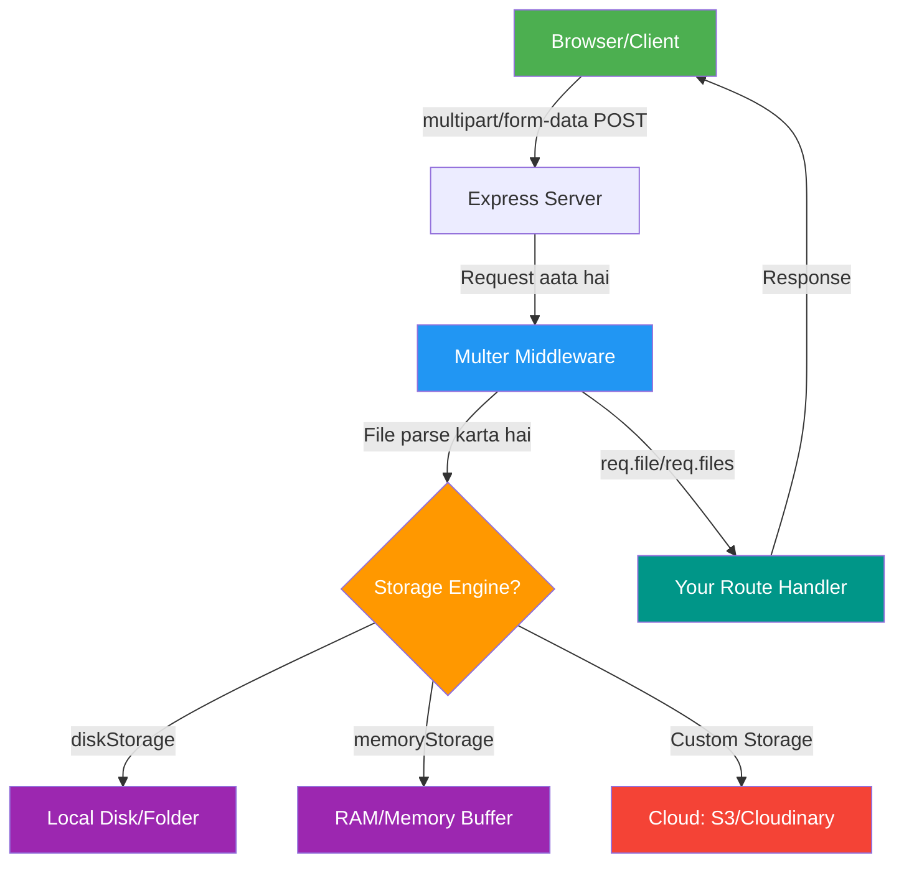

# 📘 Chapter 01: Introduction to File Uploads & Multer

> **Level:** 🟢 Beginner | **Time:** 30 min | **Language:** Hindi + English

---

## 📑 Table of Contents

1. [File Upload Kya Hota Hai?](#1-file-upload-kya-hota-hai)
2. [Real World Analogies](#2-real-world-analogies)
3. [HTTP aur File Upload Ka Rishta](#3-http-aur-file-upload-ka-rishta)
4. [multipart/form-data Kya Hai?](#4-multipartform-data-kya-hai)
5. [Multer Ka Introduction](#5-multer-ka-introduction)
6. [Multer Ka History](#6-multer-ka-history)
7. [Architecture Overview](#7-architecture-overview)
8. [Multer Internally Kaise Kaam Karta Hai?](#8-multer-internally-kaise-kaam-karta-hai)
9. [Quick Revision](#9-quick-revision)
10. [Interview Questions](#10-interview-questions)
11. [Practice Questions](#11-practice-questions)

---

## 1. File Upload Kya Hota Hai?

### Definition (Paribhasha)

**File Upload** woh process hai jisme ek client (browser/app) kisi file ko — jaise photo, document, video — server ko bhejta hai HTTP request ke zariye.

> 🔑 **Simple bhaasha mein:** Jaise aap WhatsApp pe apni photo dost ko bhejte ho, waise hi browser ek file server ko bhejta hai. Is process ko **File Upload** kehte hain.

### Why It Exists (Yeh Kyon Hai?)

Internet ke shuruat mein sirf text data transfer hota tha. Par jaise jaise technology badi, zaroorat aayi:
- Profile pictures upload karna
- Resumes bhejne
- Product images upload karna
- Documents share karna

Is zaroorat ne **file upload** ka concept banaya.

### Problem It Solves (Kya Problem Solve Karta Hai?)

| Problem | Solution |
|---------|----------|
| User apni photo share karna chahta hai | File upload se photo server pe jaati hai |
| Employee apna resume bhejta hai | PDF upload hoti hai server pe |
| Seller product image dalna chahta hai | Image upload hoti hai database mein path ke saath |

---

## 2. Real World Analogies (Asli Dunia Se Udaaharan)

### Analogy 1: Post Office 📮

Socho tum ek parcel bhejte ho:

```
YOU (Client)              POST OFFICE (Server)
    │                          │
    │──── Parcel pack karo ────►│
    │   (File ko encode karo)   │
    │                          │
    │──── Form bharo ──────────►│
    │  (HTTP Headers set karo)  │
    │                          │
    │◄─── Receipt milo ─────────│
    │  (Server ka response)     │
```

- **Aap** = Browser (client)
- **Parcel** = File
- **Post Office** = Server
- **Packing** = multipart encoding
- **Receipt** = Server response

### Analogy 2: Baggage Counter ✈️

Airport pe check-in counter pe:
- Aap apna saman dete ho → **File**
- Counter wala weighs karta hai → **File size check**
- Allowed items check karta hai → **File type validation**
- Tag lagate hain → **Unique filename**
- Locker mein rakhte hain → **Storage**

---

## 3. HTTP aur File Upload Ka Rishta

### HTTP Request Types

```
GET  Request  → Data mangna (read)
POST Request  → Data bhejna (write/upload)  ← File upload yahan hota hai
PUT  Request  → Data update karna
DELETE        → Data delete karna
```

### File Upload Mein POST Use Hota Hai

```http
POST /upload HTTP/1.1
Host: example.com
Content-Type: multipart/form-data; boundary=----WebKitFormBoundary7MA4YWxk
Content-Length: 12345

------WebKitFormBoundary7MA4YWxk
Content-Disposition: form-data; name="file"; filename="photo.jpg"
Content-Type: image/jpeg

[BINARY DATA OF THE IMAGE]
------WebKitFormBoundary7MA4YWxk--
```

**Is request ko samajhte hain:**

| Part | Matlab |
|------|--------|
| `POST /upload` | Upload route pe request bhej rahe hain |
| `Content-Type: multipart/form-data` | Bata rahe hain ki data ka format kya hai |
| `boundary=...` | Ek delimiter jo multiple parts ko alag karta hai |
| `Content-Disposition` | File ka naam aur field name |
| `[BINARY DATA]` | Actual file ka content |

---

## 4. multipart/form-data Kya Hai?

### Definition

`multipart/form-data` ek **encoding type** hai jo HTTP form submissions mein use hoti hai jab form mein files hoti hain.

> 🔑 **Simple bhaasha mein:** Normal form data mein text hota hai. Par file binary hoti hai. Dono ko ek saath bhejne ke liye **multipart/form-data** use karte hain — jaise ek parcel mein alag alag packing.

### Comparison Table

```
┌─────────────────────────────────────────────────────────┐
│              Content-Type Comparison                     │
├─────────────────────┬───────────────────────────────────┤
│ application/x-www-  │ Simple text forms ke liye          │
│ form-urlencoded     │ (default form submission)          │
├─────────────────────┼───────────────────────────────────┤
│ multipart/form-data │ Files + text ek saath bhejne ke   │
│                     │ liye (file upload mein use hota)   │
├─────────────────────┼───────────────────────────────────┤
│ application/json    │ JSON data ke liye                  │
│                     │ (REST APIs mein common)             │
└─────────────────────┴───────────────────────────────────┘
```

### HTML Mein Kaise Use Karte Hain?

```html
<!-- ❌ Wrong - File upload nahi karega -->
<form method="POST" action="/upload">
  <input type="file" name="photo">
  <button>Upload</button>
</form>

<!-- ✅ Correct - enctype add karo! -->
<form method="POST" action="/upload" enctype="multipart/form-data">
  <input type="file" name="photo">
  <button>Upload</button>
</form>
```

> ⚠️ **Common Mistake:** `enctype="multipart/form-data"` bhoolna — yeh SABSE common galti hai beginners ki!

---

## 5. Multer Ka Introduction

### Definition

**Multer** ek Node.js middleware package hai jo:
- `multipart/form-data` requests ko parse karta hai
- Uploaded files ko process karta hai
- Files ko disk ya memory mein store karta hai
- `req.file` aur `req.files` objects provide karta hai

> 🔑 **Simple bhaasha mein:** Multer ek "assistant" hai jo incoming file requests ko pakad ke process karta hai aur Express ko de deta hai. Tum directly yeh kaam karna chahte toh bahut complex hota.

### Multer Ke Bina vs Multer Ke Saath

```
❌ MULTER KE BINA:
━━━━━━━━━━━━━━━━━━━━━━━━━━━━━━━━━━━━━━━━━
Browser → Raw HTTP Request → Express
                                 │
                         Express confused! 
                    "Yeh binary data kya hai?"
                    Manual parsing karna padega
                    100+ lines of code

✅ MULTER KE SAATH:
━━━━━━━━━━━━━━━━━━━━━━━━━━━━━━━━━━━━━━━━━
Browser → Raw HTTP Request → Multer → Express
                                │         │
                         File parse   req.file
                         & save karo  available!
```

### Multer Kya Provide Karta Hai?

```javascript
// Multer ke baad aapko milta hai:
req.file = {
  fieldname: 'avatar',           // HTML input ka name attribute
  originalname: 'my-photo.jpg',  // Original file name
  encoding: '7bit',              // Encoding type
  mimetype: 'image/jpeg',        // File ka MIME type
  destination: 'uploads/',       // Save kahan hua
  filename: '1234567890.jpg',    // Saved file ka naam
  path: 'uploads/1234567890.jpg',// Full path
  size: 102400                   // File size in bytes
}
```

---

## 6. Multer Ka History

```
TIMELINE:
━━━━━━━━━━━━━━━━━━━━━━━━━━━━━━━━━━━━━━━━━━━━━━━━━━━━━
2014 │ Multer was created by expressjs team
     │ Busboy wrapper as middleware
     │
2016 │ v1.0.0 released — Stable API
     │ diskStorage and memoryStorage introduced
     │
2018 │ Community storage engines added
     │ (multer-storage-cloudinary, etc.)
     │
2020 │ TypeScript types officially supported
     │
2023 │ v1.4.5-lts.1 — LTS version
     │ Security patches
     │
2024+│ v2.x development (major refactor)
━━━━━━━━━━━━━━━━━━━━━━━━━━━━━━━━━━━━━━━━━━━━━━━━━━━━━
```

**GitHub Repository:** [github.com/expressjs/multer](https://github.com/expressjs/multer)  
**Weekly Downloads:** 5+ Million (as of 2024)  
**Maintained by:** Express.js Team

---

## 7. Architecture Overview

### Multer Ki Architecture



### Component Diagram

```
┌─────────────────────────────────────────────────────────────┐
│                    MULTER ECOSYSTEM                          │
│                                                             │
│  ┌──────────┐    ┌───────────────────────────────────────┐  │
│  │  Browser │    │           EXPRESS APP                 │  │
│  │          │    │                                       │  │
│  │ <form>   │───►│  ┌─────────┐    ┌─────────────────┐  │  │
│  │ <input   │    │  │ Router  │───►│ Multer Middleware│  │  │
│  │  type=   │    │  │         │    │                 │  │  │
│  │  "file"> │    │  └─────────┘    │ ┌─────────────┐ │  │  │
│  │          │    │                 │ │  Busboy     │ │  │  │
│  └──────────┘    │                 │ │  (parser)   │ │  │  │
│                  │                 │ └─────────────┘ │  │  │
│                  │                 │                 │  │  │
│                  │                 │ ┌─────────────┐ │  │  │
│                  │                 │ │  Storage    │ │  │  │
│                  │                 │ │  Engine     │ │  │  │
│                  │                 │ └─────────────┘ │  │  │
│                  │                 └─────────────────┘  │  │
│                  └───────────────────────────────────────┘  │
└─────────────────────────────────────────────────────────────┘
```

---

## 8. Multer Internally Kaise Kaam Karta Hai?

### Step-by-Step Internal Flow

```
STEP 1: Browser Request
━━━━━━━━━━━━━━━━━━━━━━━━━━━━━━━━━━━━━━━━━━━━
User file select karta hai → Browser multipart
request banata hai → POST /upload pe bhejta hai

STEP 2: Express Receives Request
━━━━━━━━━━━━━━━━━━━━━━━━━━━━━━━━━━━━━━━━━━━━
Express server request pakad leta hai
Middleware chain shuru hoti hai

STEP 3: Multer Middleware Execute Hota Hai
━━━━━━━━━━━━━━━━━━━━━━━━━━━━━━━━━━━━━━━━━━━━
Multer check karta hai: "Kya yeh multipart hai?"
Agar haan → Busboy se parse karta hai
Agar nahi → Next middleware ko de deta hai

STEP 4: Busboy Stream Processing
━━━━━━━━━━━━━━━━━━━━━━━━━━━━━━━━━━━━━━━━━━━━
Request ko stream mein padhta hai
File parts aur field parts alag karta hai

STEP 5: Storage Engine
━━━━━━━━━━━━━━━━━━━━━━━━━━━━━━━━━━━━━━━━━━━━
Configured storage engine call hota hai
File disk ya memory mein save hoti hai

STEP 6: req Object Update
━━━━━━━━━━━━━━━━━━━━━━━━━━━━━━━━━━━━━━━━━━━━
req.file = { ...file info }
req.body = { ...form fields }

STEP 7: Next Middleware / Route Handler
━━━━━━━━━━━━━━━━━━━━━━━━━━━━━━━━━━━━━━━━━━━━
next() call hota hai
Aapka route handler req.file use karta hai
```

---

## 9. Quick Revision

### 🔑 Key Points (Yaad Rakho)

```
✅ File upload = Client se server pe file bhejne ka process
✅ multipart/form-data = File upload ka encoding format
✅ enctype attribute HTML form mein zaroori hai
✅ Multer = Node.js middleware for multipart/form-data
✅ Multer internally Busboy use karta hai
✅ Multer req.file aur req.files provide karta hai
✅ Storage engines: diskStorage, memoryStorage, custom
```

### Memory Trick (Yaad Karne Ka Tarika)

```
M - Middleware hai Multer
U - Uploads handle karta hai
L - Local disk ya cloud pe save karta hai
T - Types (MIME) check karta hai
E - Errors gracefully handle karta hai
R - Request object populate karta hai (req.file)
```

---

## 10. Interview Questions

### Beginner Level

**Q1: Multer kya hai?**
> **Ans:** Multer ek Node.js middleware hai jo multipart/form-data ko handle karta hai, mainly file uploads ke liye. Yeh Express.js ke saath use hota hai aur request object mein `req.file` (single file) ya `req.files` (multiple files) attach karta hai.

**Q2: multipart/form-data kya hai?**
> **Ans:** Yeh ek HTTP encoding type hai jo browser use karta hai jab form mein files hoti hain. Isme data ko "parts" mein bheja jaata hai — ek part text ke liye, ek part file ke liye.

**Q3: HTML form mein file upload ke liye kya zaroori hai?**
> **Ans:** `<form>` tag mein `enctype="multipart/form-data"` aur `method="POST"` hona zaroori hai. Bina `enctype` ke file ka sirf naam jayega, actual file nahi.

**Q4: Multer kya return karta hai req pe?**
> **Ans:** 
> - Single file: `req.file` — ek object
> - Multiple files: `req.files` — array of objects
> - Form fields: `req.body` — normal form data

**Q5: Kya Multer TypeScript mein use ho sakta hai?**
> **Ans:** Haan, `@types/multer` install karke. Types officially maintained hain.

---

## 11. Practice Questions

1. Ek HTML form banao jo file upload support kare
2. Explain karo ki `multipart/form-data` aur `application/json` mein kya fark hai
3. Multer ke 3 main components kya hain?
4. `req.file` object mein kya kya hota hai — 5 properties list karo
5. Ek diagram banao jo Multer ki architecture dikhaye

---

<div align="center">

**[⬅️ Back to README](../README.md)** | **[Chapter 02: Setup & Installation ➡️](chapter-02-setup.md)**

---

*"Ek kadam aur — aage badho!"* 🚀

</div>
