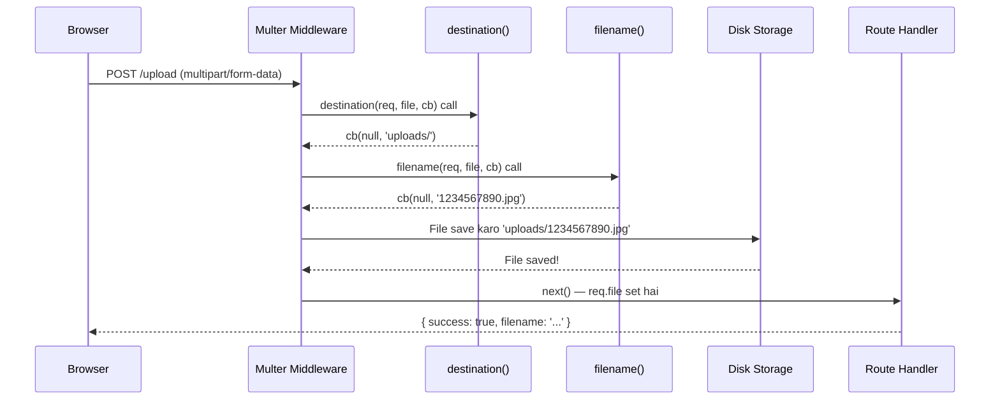

# 📘 Chapter 03: Storage Engines — diskStorage vs memoryStorage

> **Level:** 🟡 Intermediate | **Time:** 45 min | **Language:** Hindi + English

---

## 📑 Table of Contents

1. [Storage Engine Kya Hota Hai?](#1-storage-engine-kya-hota-hai)
2. [diskStorage — Disk Pe Save Karo](#2-diskstorage)
3. [memoryStorage — RAM Mein Raho](#3-memorystorage)
4. [Comparison: diskStorage vs memoryStorage](#4-comparison)
5. [Custom Storage Engine](#5-custom-storage-engine)
6. [Real-World Decision Guide](#6-real-world-decision-guide)
7. [Quick Revision](#7-quick-revision)
8. [Interview Questions](#8-interview-questions)
9. [Exercises](#9-exercises)

---

## 1. Storage Engine Kya Hota Hai?

### Definition

**Storage Engine** woh component hai jo yeh decide karta hai ki uploaded file **kahan** aur **kaise** store hogi.

> 🔑 **Simple bhaasha mein:** Jaise school mein notebook ya bag — dono jagah cheezein rakh sakte ho. Notebook = disk, bag = memory. Storage engine yeh decide karta hai ki homework (file) kahan jaayegi.

### Multer Ke Storage Types

```
MULTER STORAGE OPTIONS:
━━━━━━━━━━━━━━━━━━━━━━━━━━━━━━━━━━━━━━━━━━━━━━━
│
├── diskStorage     → File hard disk pe save hoti hai
│   (Default)          Permanent storage
│
├── memoryStorage   → File RAM mein Buffer ke roop mein rehti hai
│                     Temporary, fast
│
└── Custom Storage  → Aap khud storage logic likhte ho
    (Cloudinary,      Cloud/DB mein directly
    S3, GridFS)
━━━━━━━━━━━━━━━━━━━━━━━━━━━━━━━━━━━━━━━━━━━━━━━
```

---

## 2. diskStorage — Disk Pe Save Karo

### Definition

`diskStorage` ek storage engine hai jo uploaded files ko server ke **local file system** (hard disk) pe save karta hai.

### Syntax aur Har Parameter Ki Explanation

```javascript
const multer = require('multer');
const path = require('path');

// ━━━━━━━━━━━━━━━━━━━━━━━━━━━━━━━━━━━━━━━━━━━━━━━━
// multer.diskStorage(options)
// options: ek object jisme do callbacks hoti hain
// ━━━━━━━━━━━━━━━━━━━━━━━━━━━━━━━━━━━━━━━━━━━━━━━━
const storage = multer.diskStorage({

  // ━━━━━━━━━━━━━━━━━━━━━━━━━━━━━━━━━━━━━
  // destination(req, file, cb)
  // ━━━━━━━━━━━━━━━━━━━━━━━━━━━━━━━━━━━━━
  // Purpose: File kahan save hogi
  //
  // Parameters:
  //   req  = Express Request Object (HTTP request ki saari info)
  //   file = File object (originalname, mimetype, etc.)
  //   cb   = Callback function — cb(error, destinationPath)
  //          error → null agar sab theek hai
  //          destinationPath → kahan save karna hai
  //
  destination: function (req, file, cb) {
    
    // APPROACH 1: Simple — ek hi folder
    cb(null, 'uploads/');

    // APPROACH 2: File type ke hisaab se folder
    // if (file.mimetype.startsWith('image/')) {
    //   cb(null, 'uploads/images/');
    // } else if (file.mimetype === 'application/pdf') {
    //   cb(null, 'uploads/documents/');
    // } else {
    //   cb(null, 'uploads/others/');
    // }
  },

  // ━━━━━━━━━━━━━━━━━━━━━━━━━━━━━━━━━━━━━
  // filename(req, file, cb)
  // ━━━━━━━━━━━━━━━━━━━━━━━━━━━━━━━━━━━━━
  // Purpose: File ka kya naam hoga disk pe
  //
  // Parameters:
  //   req  = Express Request Object
  //   file = File object
  //   cb   = Callback — cb(error, filename)
  //
  filename: function (req, file, cb) {

    // APPROACH 1: Timestamp + original name
    // Date.now() = milliseconds since 1970 (unique number)
    // '-'        = separator
    // file.originalname = user ne jo naam diya tha
    const uniqueName = Date.now() + '-' + file.originalname;
    cb(null, uniqueName);

    // APPROACH 2: Timestamp + extension only (safer)
    // const ext = path.extname(file.originalname); // ".jpg", ".pdf"
    // cb(null, Date.now() + ext);

    // APPROACH 3: UUID ke saath (most unique)
    // const { v4: uuidv4 } = require('uuid');
    // cb(null, uuidv4() + path.extname(file.originalname));
  }
});

// Upload middleware banana
const upload = multer({ storage: storage });

module.exports = upload;
```

### diskStorage Ka Flow



### diskStorage Ki Properties

```javascript
// req.file ke andar yeh milta hai diskStorage ke baad:
{
  fieldname: 'avatar',                    // HTML input ka name attribute
  originalname: 'my-profile-photo.jpg',   // Original file name (jo user ne upload kiya)
  encoding: '7bit',                       // File encoding
  mimetype: 'image/jpeg',                 // MIME type
  destination: 'uploads/',               // ← diskStorage specific: kahan save hua
  filename: '1720000000000.jpg',          // ← diskStorage specific: kya naam diya
  path: 'uploads/1720000000000.jpg',      // ← diskStorage specific: full path
  size: 102400                            // File size in bytes
}
```

---

## 3. memoryStorage — RAM Mein Raho

### Definition

`memoryStorage` ek storage engine hai jo uploaded file ko **RAM mein Buffer** ke roop mein temporarily store karta hai. File disk pe save NAHI hoti.

> 🔑 **Simple bhaasha mein:** Socho aapne dost ko message bheja — wo WhatsApp pe aaya, aapne padha, aur aapne usse cloud pe save kiya. Message kabhi aapke local disk pe nahi gaya. Yahi memoryStorage karta hai.

### Kab Use Hota Hai?

```
memoryStorage use karo jab:
✅ File ko directly cloud pe upload karna ho (Cloudinary, S3)
✅ File ko process karna ho (resize, compress) pehle save karne se
✅ Temporary processing chahiye ho
✅ File disk pe save nahi karni ho security reasons se

memoryStorage use MAT karo jab:
❌ Large files upload ho sakti hain (server crash ho sakta hai)
❌ Files permanently store karni hain
❌ Multiple users simultaneously large files upload kar rahe hain
```

### Syntax

```javascript
const multer = require('multer');

// ━━━━━━━━━━━━━━━━━━━━━━━━━━━━━━━━━━━━━━━━━━━━━━━━
// multer.memoryStorage()
// Koi options nahi chahiye! Simple hai.
// ━━━━━━━━━━━━━━━━━━━━━━━━━━━━━━━━━━━━━━━━━━━━━━━━
const storage = multer.memoryStorage();

const upload = multer({ storage: storage });
```

### memoryStorage Ka Result (req.file)

```javascript
// req.file ke andar yeh milta hai memoryStorage ke baad:
{
  fieldname: 'avatar',
  originalname: 'my-profile-photo.jpg',
  encoding: '7bit',
  mimetype: 'image/jpeg',
  // ⚠️ NOTICE: destination, filename, path NAHI hai!
  buffer: <Buffer ff d8 ff e0 ...>,  // ← memoryStorage specific: actual file data!
  size: 102400
}
```

### memoryStorage Example — Cloudinary Pe Upload

```javascript
const express = require('express');
const multer = require('multer');
const cloudinary = require('cloudinary').v2;
const streamifier = require('streamifier');

const app = express();

// memoryStorage use karo
const storage = multer.memoryStorage();
const upload = multer({ storage });

// Cloudinary configure karo
cloudinary.config({
  cloud_name: process.env.CLOUDINARY_CLOUD_NAME,
  api_key: process.env.CLOUDINARY_API_KEY,
  api_secret: process.env.CLOUDINARY_API_SECRET
});

// Upload route
app.post('/upload', upload.single('image'), async (req, res) => {
  
  // req.file.buffer mein actual file data hai
  // Ise stream mein convert karke cloudinary pe upload karo
  
  const uploadToCloudinary = () => {
    return new Promise((resolve, reject) => {
      
      // Cloudinary upload stream banao
      const uploadStream = cloudinary.uploader.upload_stream(
        { folder: 'my-uploads' },
        (error, result) => {
          if (error) reject(error);
          else resolve(result);
        }
      );
      
      // Buffer ko stream mein convert karke pipe karo
      // req.file.buffer → stream → cloudinary
      streamifier.createReadStream(req.file.buffer).pipe(uploadStream);
    });
  };

  const result = await uploadToCloudinary();
  
  res.json({
    success: true,
    url: result.secure_url,      // Cloudinary URL
    publicId: result.public_id   // Cloudinary public ID
  });
});
```

---

## 4. Comparison: diskStorage vs memoryStorage

### Detailed Comparison Table

| Feature | diskStorage | memoryStorage |
|---------|-------------|---------------|
| **Storage Location** | Hard Disk (permanent) | RAM (temporary) |
| **File Persistence** | File remains after request | File lost after request |
| **req.file.path** | ✅ Available | ❌ Not available |
| **req.file.buffer** | ❌ Not available | ✅ Available |
| **Speed** | Slower (disk I/O) | Faster (in-memory) |
| **Memory Usage** | Low (uses disk) | High (uses RAM) |
| **Large Files** | ✅ Safe | ⚠️ Dangerous (OOM risk) |
| **Cloud Upload** | ❌ Extra step needed | ✅ Direct pipe possible |
| **Image Processing** | Need to read file again | Buffer directly usable |
| **Server Restart** | Files survive | Files lost |

### Visual Comparison

```
DISKSTORAGE:
━━━━━━━━━━━━━━━━━━━━━━━━━━━━━━━━━━━━━━━━━━━━━━━━━━━━━━━━━
Browser → Multer → [Disk: uploads/file.jpg] → req.file.path
                        ↑
                    Permanent!
                    Server restart ke baad bhi hai

MEMORYSTORAGE:
━━━━━━━━━━━━━━━━━━━━━━━━━━━━━━━━━━━━━━━━━━━━━━━━━━━━━━━━━
Browser → Multer → [RAM: Buffer] → req.file.buffer → Cloud
                        ↑
                    Temporary!
                    Request complete hote hi chali jaayegi
```

### Decision Flowchart

```
START: File upload karna hai
         │
         ▼
   Cloud pe upload karna hai? (Cloudinary/S3)
         │
    YES──┤──NO
         │        │
         ▼        ▼
  memoryStorage  File disk pe rakhni hai?
                        │
                   YES──┤──NO
                        │       │
                        ▼       ▼
                  diskStorage  Processing
                               (Sharp)?
                                   │
                              YES──┤
                                   │
                                   ▼
                             memoryStorage
```

---

## 5. Custom Storage Engine

### Kab Banate Hain?

Jab aapko:
- GridFS (MongoDB) mein save karna ho
- FTP server pe upload karna ho
- Custom database mein store karna ho

### Basic Structure

```javascript
// Custom Storage Engine banane ka template
const multer = require('multer');

// Custom storage class
class MyCustomStorage {
  
  // _handleFile: Multer yeh method call karta hai jab file aati hai
  // req  = Express request
  // file = File stream (incoming data)
  // cb   = Callback(error, info)
  _handleFile(req, file, cb) {
    
    // Yahan aap file stream ko kahan chahein pipe kar sakte hain
    // file.stream → actual file data ka stream
    
    console.log('File aa rahi hai:', file.originalname);
    
    // Example: File ko kuch process karo
    let uploadedBytes = 0;
    
    file.stream.on('data', (chunk) => {
      uploadedBytes += chunk.length;
    });
    
    file.stream.on('end', () => {
      // Processing complete!
      // cb(null, { ...extra info }) call karo
      cb(null, {
        customPath: '/my/custom/path/' + file.originalname,
        uploadedBytes: uploadedBytes
      });
    });
    
    file.stream.on('error', cb);
  }
  
  // _removeFile: Jab file delete karni ho (error ya cleanup)
  _removeFile(req, file, cb) {
    console.log('File delete karo:', file.customPath);
    // Yahan cleanup logic
    cb(null); // Done
  }
}

// Use karo
const upload = multer({ storage: new MyCustomStorage() });
```

---

## 6. Real-World Decision Guide

### Use Case → Storage Choice

```
📸 Profile Picture Upload (save locally)
   → diskStorage
   → uploads/profiles/ folder
   
☁️ Profile Picture Upload (save to Cloudinary)
   → memoryStorage → pipe to Cloudinary
   
📄 Resume Upload (save to server)
   → diskStorage
   → uploads/resumes/ folder
   
🖼️ Image with resizing (Sharp)
   → memoryStorage → Sharp → save/upload
   
📦 Large Video Upload
   → diskStorage (memory mein nahi aayega!)
   
🗄️ File in MongoDB (GridFS)
   → Custom Storage (multer-gridfs-storage)
```

### Production Recommendation

```
⭐ PRODUCTION BEST PRACTICE:
━━━━━━━━━━━━━━━━━━━━━━━━━━━━━━━━━━━━━━━━━━━━━━━━━
Local Development → diskStorage (simple, debug easy)
Production        → memoryStorage → Cloud Storage (S3/Cloudinary)

Kyun? 
- Multiple servers hote hain production mein
- Local disk pe save karne se files ek server pe rahti hain
- Cloud storage sabhi servers access kar sakte hain
━━━━━━━━━━━━━━━━━━━━━━━━━━━━━━━━━━━━━━━━━━━━━━━━━
```

---

## 7. Quick Revision

```
✅ Storage Engine → File kahan save hogi, yeh decide karta hai
✅ diskStorage → Permanent, hard disk pe, req.file.path milta hai
✅ memoryStorage → Temporary, RAM mein, req.file.buffer milta hai
✅ diskStorage → destination + filename callbacks
✅ memoryStorage → No options needed
✅ Large files → diskStorage use karo (memory overflow se bachao)
✅ Cloud upload → memoryStorage use karo (direct pipe)
✅ Custom storage → _handleFile() aur _removeFile() implement karo
```

---

## 8. Interview Questions

**Q1: diskStorage aur memoryStorage mein main difference kya hai?**
> diskStorage files ko hard disk pe save karta hai (permanent), jabki memoryStorage files ko RAM mein Buffer ke roop mein rakhta hai (temporary). diskStorage mein `req.file.path` available hai, memoryStorage mein `req.file.buffer`.

**Q2: memoryStorage use karne ka kya risk hai?**
> RAM limited hoti hai. Agar bahut saari badi files ek saath upload ho rahi hain toh server ki memory full ho sakti hai, jisse Out of Memory (OOM) error aur server crash ho sakta hai.

**Q3: Cloud storage ke liye kaunsa Multer storage use karte hain?**
> `memoryStorage` — file buffer RAM mein rakhte hain, phir us buffer ko directly Cloudinary ya S3 pe pipe kar dete hain. Disk pe nahi save karte.

**Q4: Custom storage engine kaise banate hain?**
> Ek class banate hain jisme `_handleFile(req, file, cb)` aur `_removeFile(req, file, cb)` methods implement karte hain. Phir `multer({ storage: new MyCustomStorage() })` ke roop mein use karte hain.

**Q5: Default storage engine kaunsa hai Multer mein?**
> Agar koi storage specify nahi kiya toh Multer **memoryStorage** use karta hai by default.

---

## 9. Exercises

### Exercise 1 (Easy)
diskStorage setup karo jahan:
- Images `uploads/images/` mein jayein
- PDFs `uploads/documents/` mein jayein
- Filename: `timestamp-originalname`

### Exercise 2 (Medium)
memoryStorage ke saath ek route banao jo:
- File ko memory mein lo
- File ka size check karo buffer se
- Agar 1MB se zyada ho → error bhejo
- Warna success

### Exercise 3 (Hard)
Ek custom storage engine banao jo:
- File ko local disk pe save kare
- Aur saath mein ek `.txt` log file mein upload ka record rakhe
- Log format: `timestamp | filename | size | mimetype`

---

<div align="center">

**[⬅️ Chapter 02: Setup](chapter-02-setup.md)** | **[Chapter 04: Single Upload ➡️](chapter-04-single-upload.md)**

</div>
